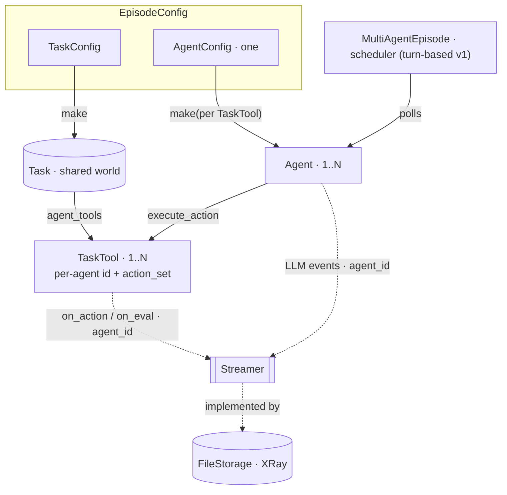

# RFC: Multi-agent episodes (cube-harness companion to `streamable-task`)

**Status:** DRAFT — high-level (we expand as we go)
**Author:** Alexandre Lacoste (w/ Claude)
**Date:** 2026-06-05
**Upstream:** `cube-standard/openspec/changes/streamable-task` (#214) — defines the task side.

## Context

`streamable-task` (upstream) exposes a multi-agent task as **one `Task` (shared world)
+ N `TaskTool`s** (`task.agent_tools()`, one per agent, each with its own id + action
space), plus an abstract `Streamer`. The standard owns the *world*; cube-harness owns the
*runtime* — so this companion is just "how the harness drives N agents over those tools."
Target first deliverable: a real multi-agent CUBE next week.

## What changes (harness)

### 1. `MultiAgentEpisode` (a sibling of `Episode`)
A new runtime object. Today's `Episode` drives one agent loop; `MultiAgentEpisode` builds
the task once, reads `task.agent_tools()`, builds one agent per tool, and drives them under
a **scheduler**. Single-agent `Episode` stays as the **N=1 fast path** (no scheduler, no
per-agent tagging) — both finalize the same way.

### 2. One `AgentConfig`, produced per `TaskTool`
`EpisodeConfig` carries a **single `AgentConfig`** (homogeneous agents — same policy,
different identity / action space per seat). The arena calls it once per `TaskTool`:

```python
agents = [agent_config.make(action_set=tt.action_set, agent_id=tt.agent_id)
          for tt in task.agent_tools()]
```

So **`AgentConfig.make()` gains identity from the `TaskTool`** (`agent_id`, and the
per-agent `action_set`). One config, N right-shaped agents. *(Heterogeneous agents —
different policies per role — is a forward extension: an `AgentConfig` per role / a
mapping. Out of v1.)*

### 3. Scheduler — start **turn-based**, sequential, sync
v1 is **round-robin turn-based**: the arena polls agent *i*, runs its turn, advances. This
**reuses the clean sync-episode model** from #492 (no event loop on the thread) — so it
inherits sync-Playwright / single-stack-pdb for free and dodges the async concurrency
traps. `async` (N concurrent loops over serialized world state) and `batch` (barrier +
joint resolution) are **deferred**; the task can already gate legality ("not your turn" →
`StepError`).

**Legality lives in the cube, scheduling in the arena.** Per upstream, `TaskTool.action_set`
is a **dynamic property** (recomputed per turn) — so phase gating, legal-action masking, and
real-time observe/no-op are expressed by the *cube*, and the arena only decides *who it polls
next*. Harness implication: **the agent re-reads `action_set` each turn** (rebuilds its tool
schema per turn) rather than caching it at `make()` — a small change to the agent loop that
single-agent inherits too.

### 4. Trajectory gains an `agent_id` dimension
`ToolCallEvent` / `LLMCallEvent` (and the `Streamer`/`EventStreamer`) carry **`agent_id`**.
The env half comes from each `TaskTool`'s `on_action`/`on_eval`; the agent half (LLM /
reasoning) from each agent's connector — both into one sink, tagged per agent. The
trajectory is then a unified timeline **and** per-agent slices. (XRay per-agent lanes:
later.)

### 5. Termination + budget — start simple
- **Termination:** the episode ends on the global `task.finished()`/terminal `evaluate`;
  a per-agent `final_step` retires that seat (the arena stops polling it). Exact policy is
  a decision.
- **Budget:** v1 = one shared episode budget; per-agent budgets are a forward option.

## Flow



## v1 scope (the multi-agent CUBE next week)

Fixed N agents · turn-based · homogeneous (one `AgentConfig` parameterized per `TaskTool`)
· sync · one shared budget · per-agent + episode finalize. Everything else deferred.

## Open decisions

1. `AgentConfig.make` signature: `make(action_set, agent_id)` vs `make(task_tool)`
   (hand the whole `TaskTool`).
2. Termination policy (global `finished` vs all-seats-retired vs coordinator).
3. Per-agent vs shared budget.
4. Heterogeneous agents (per-role configs / a `{role: AgentConfig}` map) — when.
5. `async` / `batch` schedulers — after turn-based lands.

`deltas.md` stays thin until v1 firms up.
